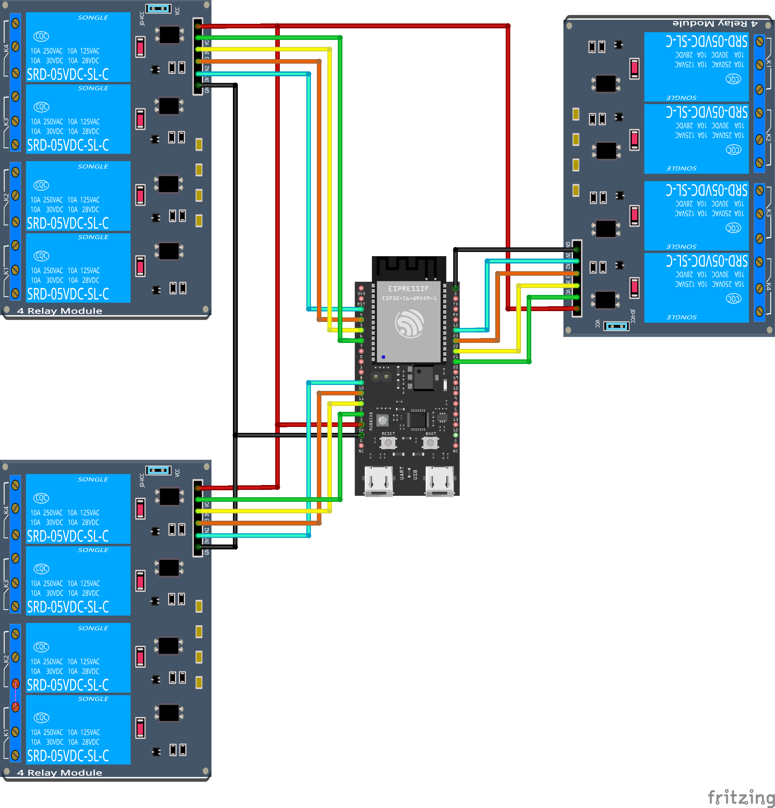

# esp32c6 Zigbee Lights Controller

This projects creates a simple Zigbee light using an esp32c6. As it turns out, the SDK provided by
ESP folks, while comprehensive, lacks documentation. So this project serves dual purpose of me
making my lights "smart" (i.e. being able to control them via Home Assistant), and as a reference
for any future Zigbee projects I might undertake.

> [!CAUTION]
> This project is by no means a complete tutorial, or a comprehensive sample of
> `esp-zigbee-lib`. There are plenty of parts of this projects where I stopped experimenting when
> stuff worked. Readers are encouraged to experiment more and challenge any assumptions made
> in the project. I am sure there is plenty of room for improvement in this code. If you
> do find these improvements, feel free to either open a pull request, or file an Github issue.

## Hardware

The code doesn't make any specific assumptions about the hardware, so as long as esp-zigbee-sdk
supports your chip, this project should generally work.

But for completeness' sake, here is the specific hardware I used:
1. [ESP32-C6-DevKitC-1-N8](https://a.co/d/01APvgZ)
2. Floor Lamps: https://a.co/d/ijMNrwh
3. 4 Relays per lamp remote

Strictly speaking, the board is not connected directly to the lamps, but rather controls the lamps
via the remote that comes with the lamps. Each button in the remote is hooked up to a relay, each
of which is controlled by a GPIO pin on the ESP32C6 board. So to turn a particular lamp on or off,
the esp32c6 simply needs to "press" the power button on the proper remote by toggling the GPIO
attached to the relay that shorts the power button on said remote.

For reference, this is how my esp32c6 is wired:



## Software

This project was written using ESP-IDF extension for VSCode. I understand there is a way to do this
with PlatformIO, but I couldn't be bothered to set up PlatformIO.

### Steps to Build and Flash the Firmware

1. Set up ESP-IDF extension in VSCode. It is actually surprisingly easy to work with!
2. Clone this repository.
3. Open this repository in VSCode. ESP-IDF extension should automatically detect it as an ESP-IDF
   project.
4. Set up `sdkconfig`. Ensure that your `sdkconfig` (generated via `menuconfig`) has the following
   flags set:
  - Zigbee flags:
    ```Kconfig
    CONFIG_ZB_ENABLED=y
    CONFIG_ZB_ZCZR=y
    CONFIG_ZB_RADIO_NATIVE=y
    ```
  - Custom Partition Table (This is needed for zigbee stack to work. See
    [`partitions.csv`](partitions.csv)):
    ```KConfig
    CONFIG_PARTITION_TABLE_CUSTOM=y
    CONFIG_PARTITION_TABLE_CUSTOM_FILENAME="partitions.csv"
    CONFIG_PARTITION_TABLE_FILENAME="partitions.csv"
    ```
5. Set up C/CPP configuration by running the command: `ESP-IDF: Create VS Code Configuration
   Folder` from the command pallete. This just enables C/CPP intelliSense support.
6. Build and flash the firmware using ESP-IDF. ESP-IDF will pull in all necessary dependencies and
   build the firmware.

### Add Device to Home Assistant (via Zigbee2MQTT)

This is not strictly a part of the firmware, but adding this custom device to Home Assistant
required some extra steps, so I am putting those steps here for posterity.

This section assumes Zigbee2MQTT is already running and configured properly in the Home Assistant environment. If you're using ZHA, I am not sure what the steps are.

Do the following in your Home Assistant / Zigbee2MQTT configuration:
1. Copy [`esp32c6_lamps_controller.js`](docs/esp32c6_lamps_controller.js) to
   `/config/zigbee2mqtt/external_converters/esp32c6_lamps_controller.js` (or wherever you have your
   external converters directory).
2. Change the `model` and `vendor` fields in the file to match your device's model and vendor.
   These are the manufacturer information set in [main.cpp](main/main.cpp).
3. Restart Zigbee2MQTT.
4. Open network to new devices (Permit Join).
5. Boot up the esp32c6. If the firmware if running correctly, it should boot in pairing mode and
   automatically join the network.
6. The device should show up in Zigbee2MQTT and Home Assistant as three light entities, each
   controllable independently.

# Fin.
